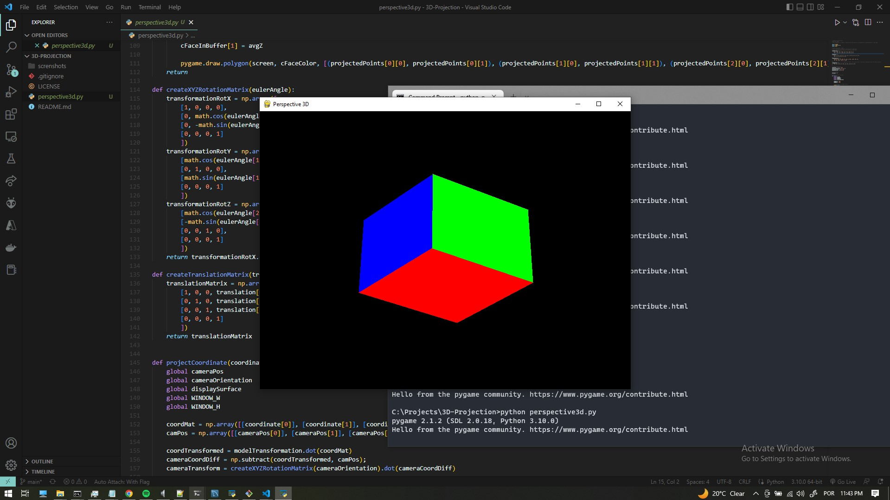
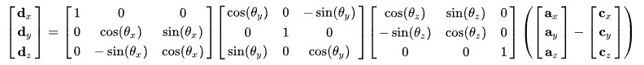
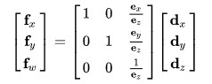
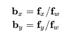

# 3D-Projection
3D Projection of a Cube rendered by Software

## What is this project?
This project is an application that renders 3D models using just 2D primitive functions. All the geometric transformations used for projection, viewport and models are all calculated in the code itself.


## What's the point of it?
The objective of creating this project is just for self validation of my knoledge on Analytic Geometry and Linear Algebra and test my skills using transformation matrix.

## How does it works?
This code calculates the transformation for a perspective projection, the calculus simulates a Pinhole Camera Model so we basically define the Pinhole Position (The position of the camera), the display surface's position relative to the camera pinhole (like a photographic film on the back of the camera), the orientation of the camera and the point to be projected. 


The first step is to calculate the camera transformation that is basically the dot product of the rotation matrices of the camera orientation by the difference of the projected point to the camera like the picture bellow ("a" is the point to be projected and "c" is the position of the camera):



The next step is to project the transformed point into the 2D Plane calculating the dot product of the matrix bellow that used homogeneous coordinates by the display surface's position ("e"):



And then calculate the point projected into the 2D Plane:



## Calculating the FOV
The Field of View is directly related to the distance of the display surface's position, since the angle of the field can be determined by "radAngle = 2 * arctan(1/Ez)" we can use a reverse operation to calculate the position of the display surface's Z position based on the angle. The operation to determine the Z position of the display surface's Z position is the following:

```
Zposition = -math.tan(1 / ((fovDeg * math.pi) / 180)) * 2
```

## Calculating the Depth
Since using a Z-Buffer would not be a good ideia without using the GPU the easiest way so far is to use the Painter's Algorith. So basically everytime we calculate de camera projection transformation (The "d" matrix above) we store the z value that at this point is already relative to the camera, and then for the subsequent frames we sort the order of the faces that should be rendered by the last Z Value, this way we ensure that the faces from behind the cube are rendered first avoid some artifacts.

## References
Source: https://www.scratchapixel.com/lessons/3d-basic-rendering/3d-viewing-pinhole-camera  
Source: https://en.wikipedia.org/wiki/3D_projection  
Source: https://en.wikipedia.org/wiki/Rotation_matrix  

## License
MIT License

Copyright (c) 2022 Felipe Durar

Permission is hereby granted, free of charge, to any person obtaining a copy
of this software and associated documentation files (the "Software"), to deal
in the Software without restriction, including without limitation the rights
to use, copy, modify, merge, publish, distribute, sublicense, and/or sell
copies of the Software, and to permit persons to whom the Software is
furnished to do so, subject to the following conditions:

The above copyright notice and this permission notice shall be included in all
copies or substantial portions of the Software.

THE SOFTWARE IS PROVIDED "AS IS", WITHOUT WARRANTY OF ANY KIND, EXPRESS OR
IMPLIED, INCLUDING BUT NOT LIMITED TO THE WARRANTIES OF MERCHANTABILITY,
FITNESS FOR A PARTICULAR PURPOSE AND NONINFRINGEMENT. IN NO EVENT SHALL THE
AUTHORS OR COPYRIGHT HOLDERS BE LIABLE FOR ANY CLAIM, DAMAGES OR OTHER
LIABILITY, WHETHER IN AN ACTION OF CONTRACT, TORT OR OTHERWISE, ARISING FROM,
OUT OF OR IN CONNECTION WITH THE SOFTWARE OR THE USE OR OTHER DEALINGS IN THE
SOFTWARE.
